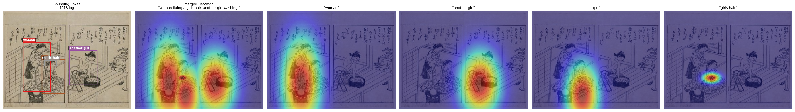
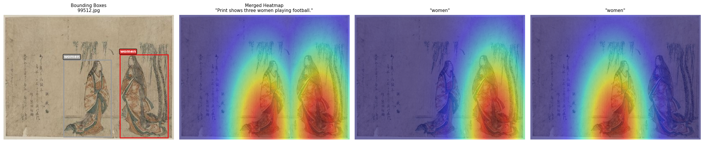
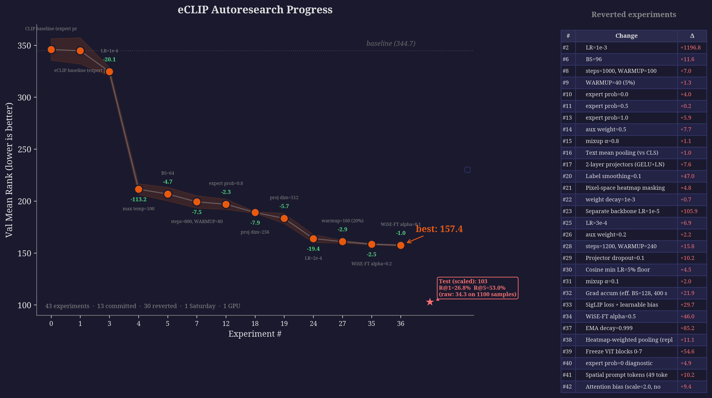

# eCLIP Autoresearch

I wanted to implement Karpathy's Autoresearch on this project. Since it shines on scale experiments with quick turnarounds, a small dataset of Japanese woodblock prints with spatial annotations seemed like a good fit. 

The agent iteratively improved the eval metric (Mean Rank) by modifying a single `train.py` file, running experiments in a Docker sandbox, and committing improvements — all based on the priorities outlined in `program.md`. The agent's "thought process" and experiment history are documented in `scratchpad.md`.

### Dataset 
I picked the [Ukiyo-eVG](https://zenodo.org/records/13120879) dataset, which consists of ~11K Japanese woodblock prints with phrase -> bounding box annotations from the [CIGAr](https://arxiv.org/abs/2410.12369) paper (ECCV 2024 VISART). The bounding boxes were converted to gaussian heatmaps and fed into the model as an additional input, similar to the Radiologist eye-gaze heatmaps in the original paper. 

<p align="center">
  
  
</p>

*Expert spatial annotations: bounding boxes converted to gaussian heatmaps guide the model to focus on specific regions (e.g. "a girl", "her large pet bird", "a person playing football").*

## The Loop

1. `start.sh` launches Claude Code with locked-down permissions and an initial prompt. 
2. The agent reads `program.md` for experiment priorities, makes one change to `train.py`, runs it inside a Docker container, and checks the result. 
3. If the metric improved, it commits. If not, it reverts. 
4. Then it updates `scratchpad.md` with what it learned 
5. Waits 2 minutes for the GPU to cool down, and goes to Step 2.

```bash
./autoresearch/start.sh                     # fresh start, opus
./autoresearch/start.sh resume sonnet       # resume with sonnet

# Plot results
cd autoresearch && uv run python plot_results.py --plot --both

# Final training on all data + test evaluation
cd autoresearch && uv run python train.py --final
```

## The Sandbox

The agent can't do anything outside the experiment loop. Permissions are passed as CLI flags to Claude Code — no settings files to accidentally override.

- **Can only edit**: `train.py`, `scratchpad.md`
- **Can only run**: `./autoresearch/run.sh` (Docker: `--network=none`, `--memory=24g`, read-only code mount)
- **Can only git**: add, commit, checkout, log, diff, status
- **Cannot**: push, rm, pip install, curl, wget, run python directly, docker, sudo

## Results



**42 experiments** · 13 committed · 29 reverted · 1 Saturday · 1 4090 GPU

| | Mean Rank | img→txt R@1 | img→txt R@5 | img→txt R@10 | txt→img R@1 | txt→img R@5 | txt→img R@10 |
|---|---|---|---|---|---|---|---|
| **Test** | **34.30** | **26.8%** | **53.0%** | **63.1%** | **25.6%** | **51.4%** | **62.5%** |

Val mean rank: **344.68 → 157.43** (54% reduction) across the experiment loop.
Model: ViT-Small (22M) + DistilBERT (66M) + HeatmapProcessor · ~90M params · 800 steps (~3 min on 4090)

## Top findings

1. **Temperature clamp fix** (−113 mean rank): The learnable temperature was initialized at `log(1/0.07) ≈ 2.66` → `exp(2.66) ≈ 14.3`, immediately clamped to `MAX_TEMPERATURE=2.0`. The temperature never learned. Fixing the clamp was the single biggest win.

2. **Projection dim matters** (−14): Scaling `PROJ_DIM` from 128 → 256 → 512 consistently helped.

3. **LR re-tuning after architecture changes** (−19): After increasing `PROJ_DIM`, the original LR was too conservative. Re-tuning to `2e-4` gave a large win.

4. **WiSE-FT** (−3.5): Interpolating pretrained and fine-tuned backbone weights (`α=0.1`) gave a small but consistent improvement.

5. **Expert mechanism** (~5 points): Spatial annotations via heatmap attention consistently help, but hyperparameter tuning matters 30x more at this scale. 


## Acknowledgements

[Ukiyo-eVG](https://zenodo.org/records/13120879) — ~11K Japanese woodblock prints with phrase→bounding box annotations from the [CIGAr](https://arxiv.org/abs/2410.12369) paper (ECCV 2024 VISART).
